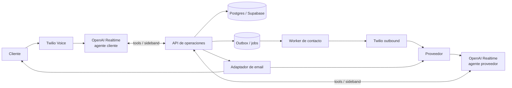

# ADR 0001 — Operación durable y voz desacoplada

**Estado:** propuesto para el MVP de la hackathon  
**Fecha:** 2026-08-29

## Contexto

Un cliente llama para pedir un flete desde el puerto hasta González Catán. El
sistema debe entender el pedido, abrir una operación, llamar a varios
proveedores, comparar cotizaciones, cerrar una reserva y enviar las
confirmaciones por email. Habrá una conversación de voz de cara al cliente y
otra de cara a proveedores.

Una llamada es efímera: puede cortarse y un proveedor puede responder mucho
después. La operación, en cambio, debe sobrevivir a ambas cosas. No conviene
usar el historial de un agente como la fuente de verdad.

## Decisión

1. `operation` es el agregado y la fuente de verdad. Se persiste antes de
   iniciar el contacto con proveedores.
2. Los dos agentes son configuraciones de conversación con responsabilidades
   distintas, no dos backends con estados independientes:
   - **Agente de cliente:** toma el pedido, completa campos faltantes y obtiene
     consentimiento para solicitar cotizaciones.
   - **Agente de proveedor:** presenta el pedido, toma una oferta estructurada
     y nunca promete un cierre por sí solo.
3. El modelo sólo actúa mediante herramientas acotadas. El servidor valida y
   persiste `create_operation`, `update_operation`, `create_quote`,
   `select_quote` y `confirm_booking`; el modelo no escribe SQL ni interpreta
   respuestas como un booking definitivo.
4. El contacto con proveedores se modela como trabajos independientes en una
   cola/outbox. Se ejecutan en paralelo con límite de concurrencia, reintentos
   e idempotencia. Nunca se bloquea la llamada del cliente esperando esas
   respuestas.
5. La selección y la confirmación son transiciones de estado de servidor. En
   el demo, la regla puede ser “menor precio que cumpla restricciones” *más*
   confirmación explícita del cliente; enviar emails ocurre únicamente tras
   `booking_confirmed`.

## Arquitectura propuesta

El camino de voz puede implementarse de dos maneras. La opción a validar
primero es **Twilio SIP hacia OpenAI Realtime**, que deja a OpenAI transportar
el audio y al servicio propio recibir el webhook de llamada entrante, aceptarlo
y mantener el canal sideband para las herramientas. Como alternativa de
respaldo, Twilio Media Streams conecta por WebSocket seguro al runtime propio,
que puentea audio hacia Realtime. La prueba vertical inicial decide entre ambas
con una llamada real, no por suposición.

## Infraestructura de hackathon

| Necesidad | Elección para el MVP | Motivo |
| --- | --- | --- |
| Estado, proveedores, cotizaciones y eventos | Supabase Postgres | Datos relacionales y persistencia simple. |
| Prueba local pública | Cloudflare Tunnel | Expone HTTPS/WSS sin desplegar cada cambio. |
| Runtime de voz y worker E2E | Servicio de contenedor siempre activo (p. ej. Railway/Render/Fly) | Evita depender de la vida limitada de una función serverless. |
| Dashboard / landing | Vercel si hace falta | Es buen encaje para UI, pero no es el dueño del socket/worker de voz. |

Supabase y Vercel no reemplazan por sí solos el runtime de conversación de
larga vida. Un túnel sirve para desarrollo; el día de la demo se prueba contra
el servicio desplegado y se conserva el túnel como plan B.

## Consecuencias

- Una misma operación puede recibir respuestas tardías, reintentos y varias
  llamadas sin perder correlación.
- `operation_id` se propaga a cada llamada, cotización, evento y email.
- La parte más incierta —telefonía + Realtime— se resuelve como un spike
  temprano y aislado. El resto del equipo puede avanzar con agentes simulados
  y herramientas HTTP.
- Para el MVP se usan proveedores de prueba con números y emails consentidos;
  no se hacen reservas reales ni se contacta a terceros no autorizados.

## Evidencia técnica

La API Realtime soporta llamadas entrantes SIP que el servidor acepta y
configura, y la sesión admite instrucciones, herramientas y trazas. Esto
habilita el camino SIP + sideband, pero exige probar la configuración concreta
de Twilio temprano. [Referencia oficial de OpenAI](https://developers.openai.com/api/reference/python/resources/realtime/subresources/calls/methods/accept).
