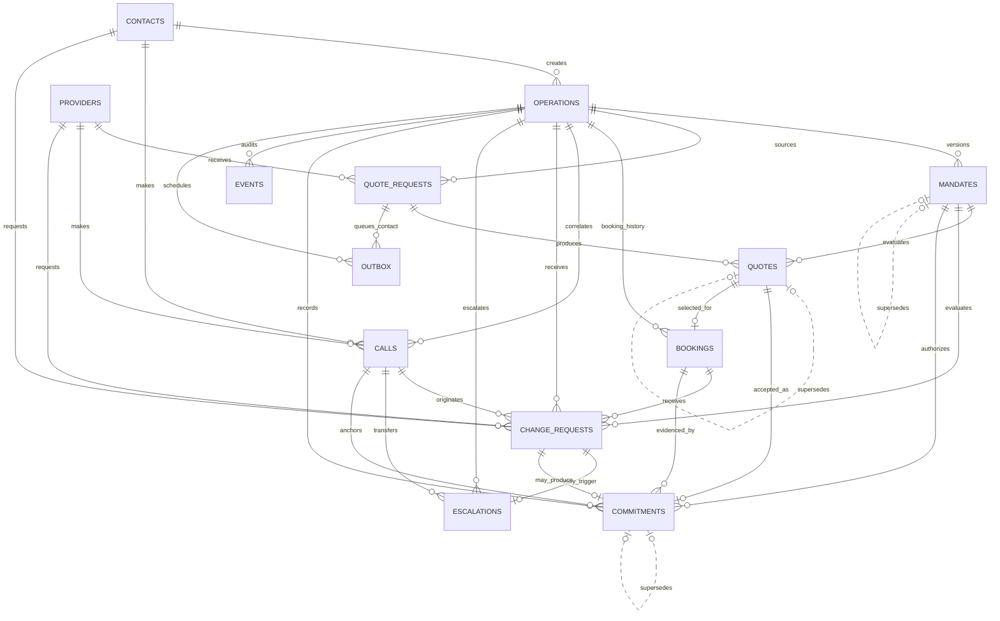

# Diseño del midfield contractual V1

**Estado:** congelado en conversación; pendiente de revisión del documento  
**Fecha:** 2026-08-29  
**Issue:** #1 — Congelar schema, tools, eventos y entorno

## Objetivo

Definir el modelo relacional estable contra el cual los cuatro frentes pueden
construir y mockear. La primera implementación cubre una operación de un solo
contenedor, el ERP mock del cliente, mandatos versionados, negociación con
cotizaciones históricas, booking mutable con compromisos inmutables, cambios,
escalaciones, auditoría y trabajo pendiente.

El diseño evita una V1 descartable: futuras extensiones deben ser aditivas y no
romper las claves, cardinalidades ni significados congelados aquí.

## Alcance de V1

- `contacts` son clientes autorizados del ERP mock.
- `providers` son transportistas habituales del cliente, no un marketplace de
  Nauta.
- No existe `organizations`; el MVP usa una sola empresa implícita.
- Una `operation` representa exactamente un contenedor.
- Todo requisito expresado por el cliente vive en una versión de `mandates`;
  no existe una capa separada de preferencias.
- El plazo mínimo de pago se expresa en días desde `invoice_date`.
- `bookings` representa el estado actual mutable; `commitments` conserva el
  historial inmutable.
- `change_requests` sólo admite `reschedule` y `cancel`.
- Las llamadas desconocidas se rechazan sin persistirse en V1. Una llamada
  inbound de un cliente autenticado puede persistirse temporalmente sin
  operación mientras su intención sea `undecided`.
- Una cancelación encola contactos alternativos en `outbox`, pero V1 no
  ejecuta esos trabajos.

Quedan fuera de V1 las tablas dedicadas a transcript completo, tracks de
grabación, entregas de notificaciones, agregados de métricas y organizaciones.
`calls` conserva la URL de grabación; `commitments` conserva el fragmento de
transcript y el checkpoint necesarios para evidencia.

## DER congelado

## Tablas y responsabilidades

### ERP mock

`contacts` guarda nombre, teléfono único, email, autorización y actividad del
cliente. `providers` guarda los mismos datos de contacto, actividad y
capacidades opcionales en JSONB. Sin organización explícita, teléfonos de
contacts y providers son únicos globalmente en V1.

### Operación y mandato

`operations` contiene una referencia pública generada por el servidor
(`OP-000001`), cliente, estado, tipo de contenedor, peso bruto, origen, destino,
depósito de devolución del vacío, restricciones operativas, notas de carga,
referencia al mandato vigente y un indicador de que los términos actuales
todavía requieren confirmación. Una actualización operativa se aplica
directamente a `operations`; si ya existía un mandato, el trigger activa
`mandate_confirmation_required`. Mientras esté activo, ningún handler puede
iniciar sourcing, contactar proveedores ni crear o modificar un booking.

La tool de lectura `list_open_operations` no recibe identificadores: deriva el
contacto autenticado de la sesión y devuelve únicamente sus operaciones no
canceladas ni fallidas con referencia pública, estado y un resumen mínimo. Está
disponible al decidir entre crear, actualizar o cancelar, y se retira cuando la
llamada fija uno de esos caminos.

`mandates` conserva versiones inmutables por operación. Cada versión tiene un
snapshot obligatorio de los términos operativos confirmados, tope, moneda,
varias ventanas de acción en JSONB, plazo mínimo de pago en días, ancla fija
`invoice_date`, llamada de confirmación y referencia a la versión reemplazada.
El servidor construye el snapshot desde `operations`; el modelo no puede
aportarlo ni modificarlo. Una nueva versión vuelve inelegibles las cotizaciones
evaluadas contra versiones anteriores; V1 genera pedidos nuevos en lugar de
reevaluarlas. `confirm_mandate` crea la versión nueva, actualiza
`current_mandate_id` y limpia `mandate_confirmation_required` dentro de la misma
transacción.

### Cotización y booking

`quote_requests` representa un intento idempotente de contacto con un provider
y tiene estado y vencimiento. Puede producir varias versiones inmutables de
`quotes` durante una negociación. Cada quote conserva rango de precio mínimo y
máximo, moneda, ventana propuesta, plazo de pago, vigencia, condiciones,
mandato evaluado, veredicto y referencia a la versión reemplazada. El servidor
evalúa el máximo del rango contra el tope y compara cotizaciones válidas por su
máximo: gana el menor peor caso.

La negociación admite exactamente una contraoferta por pedido. La primera
cotización completa que exceda el tope por precio recibe `contraoferta`, incluso
si `price_min` también está por encima del mandato; la respuesta nunca revela el
tope. La propuesta siguiente se guarda como una nueva versión: si su máximo ya
entra, recibe `dentro`; si todavía excede, recibe `fuera`. El servidor cuenta la
ronda mediante las versiones persistidas, no el prompt. Errores estructurales o
conflictos con términos operativos fijos no consumen esa ronda.

Todas las propuestas se guardan. Sólo una cotización vigente y dentro del
mandato produce un compromiso aceptado y puede ser seleccionada por un booking.

`bookings` guarda el estado actual, cotización elegida, ventana acordada, plazo
de pago, precio final exacto, referencia de confirmación y timestamps de
confirmación o cancelación. `confirm_booking` sólo puede fijar un precio dentro
del rango cotizado y debajo del tope vigente. Puede haber historial de bookings,
pero un índice parcial permite a lo sumo uno vigente por operación.

### Cambios y escalaciones

`change_requests` registra quién solicitó el cambio, llamada de origen, booking,
mandato evaluado, tipo, razón, veredicto y resolución. Exactamente uno entre
`requested_by_contact_id` y `requested_by_provider_id` está presente.
`reschedule` exige una única ventana propuesta; `cancel` exige que esté ausente.

Una reprogramación dentro del mandato actualiza el booking y crea un compromiso
que reemplaza al anterior. Una cancelación cancela el booking y crea un
compromiso `cancellation`. La cancelación del provider devuelve la operación a
`sourcing`, crea nuevos pedidos de cotización y deja trabajos de contacto en el
outbox.

`escalations` registra operación, llamada viva, solicitud de cambio opcional,
mandato, razón, estado, conference SID y tiempos. La referencia a solicitud es
opcional porque una escalación también puede surgir de un pedido humano o una
conversación hostil sin cambio estructurado.

### Evidencia y ejecución durable

`calls` sólo registra llamadas aceptadas y exactamente una contraparte conocida:
contact o provider. Conserva IDs de Twilio/OpenAI, persona, dirección, resultado,
URL de grabación y tiempos. Una llamada inbound de cliente comienza con
`operation_intent = undecided` y una inbound de provider con
`provider_intent = undecided`; ambas pueden tener `operation_id = NULL` hasta
que la primera tool de negocio vincule una operación y bloquee la intención.
Las llamadas outbound de provider nacen con operación y propósito conocidos.

Para cotización outbound se ofrecen `create_quote`, `decline_quote_request` y
`escalate`; para confirmar booking, `confirm_booking`, `decline_booking` y
`escalate`; para renegociar, `reschedule_booking`, `decline_reschedule` y
`escalate`. Una inbound de provider empieza con `list_provider_operations`,
`create_quote`, `reschedule_booking`, `cancel_booking` y `escalate`; después de
la primera mutación se retiran los caminos incompatibles. También puede usar
las variantes de rechazo o `confirm_booking` cuando devuelve una llamada sobre
un booking pendiente. `cancel_booking`
representa que el provider abandona su compromiso y devuelve la operación a
`sourcing`; no es equivalente a `cancel_operation` del cliente.

`commitments` es append-only. Conserva tipo (`quote`, `booking`, `reschedule` o
`cancellation`), snapshot JSONB de términos, operación, mandato, llamada,
entidades de dominio opcionales, fragmento de transcript, checkpoint y posible
compromiso reemplazado. Una cotización rechazada no crea compromiso.

`events` es el log inmutable del dominio con tipo, payload, operación, llamada o
compromiso opcionales, instante y checkpoint.

`outbox` guarda trabajo transaccional pendiente con operación, pedido de
cotización opcional, tipo, payload, estado, intentos, idempotency key y tiempos.
En V1 se escriben trabajos `contact_provider` con estado `pending`; no hay
consumidor automático para el camino de reemplazo posterior a cancelación.

## Invariantes de base de datos

- `UNIQUE (operation_id, version)` para mandatos y
  `UNIQUE (quote_request_id, version)` para cotizaciones.
- Cada fila puede ser reemplazada por una sola sucesora; las referencias
  `supersedes_mandate_id`, `supersedes_quote_id` y
  `supersedes_commitment_id` son únicas cuando no son nulas.
- Referencias `supersedes_*` no pueden apuntar a la misma fila.
- Mandato vigente, mandato evaluado y entidades hijas pertenecen a la misma
  operación.
- Cada mandato contiene el snapshot completo de la operación que el cliente
  confirmó; cambiar cualquier término operativo requiere una versión nueva.
- Cambiar términos de una operación con mandato vigente activa automáticamente
  `mandate_confirmation_required`; las acciones externas quedan bloqueadas hasta
  que `confirm_mandate` cree la versión siguiente.
- `current_mandate_id` puede ser nulo mientras se recolectan datos y es
  obligatorio antes de entrar en `sourcing`.
- Un booking activo como máximo por operación.
- Las referencias públicas de operación son únicas, generadas por el servidor y
  nunca aceptadas como UUID internos.
- Un booking sólo selecciona una cotización vigente y dentro del mandato.
- La selección usa `price_max`; el precio final del booking debe quedar entre
  `price_min` y `price_max` y dentro del mandato vigente.
- Exactamente uno de contact/provider en llamadas y solicitantes de cambio.
- Sólo una llamada inbound con intención `undecided` puede carecer de operación;
  una vez vinculada, no puede cambiar de operación ni de intención.
- Un teléfono no puede aparecer a la vez en `contacts` y `providers`; el ruteo
  por caller ID debe ser inequívoco.
- Ventanas JSONB tienen una forma contractual con `start_at < end_at`.
- Precio y peso son positivos; plazo de pago es no negativo.
- `commitments` y `events` rechazan `UPDATE` y `DELETE`.
- Idempotency keys son únicas y nunca se reciclan.

## Contratos derivados

El DDL implementará este modelo en `contracts/schema.sql`. Los esquemas de tools
y el catálogo de eventos se diseñarán después del DDL, sin introducir entidades
que contradigan este DER. `.env.example` sólo declarará nombres de configuración
y no contendrá secretos.

## Follow-ups explícitos

- Persistir y auditar llamadas rechazadas de números desconocidos.
- Consumir outbox con worker, reintentos, locks y backoff.
- Reevaluar una misma cotización contra distintas versiones de mandato mediante
  una tabla `quote_evaluations`.
- Transcript completo segmentado y grabaciones con múltiples tracks.
- Historial de entregas de email y otros canales.
- Organizaciones o tenancy para múltiples empresas cliente.
- Esquemas de pago con anticipos, porcentajes o cuotas.
- Métricas materializadas y observabilidad externa.
